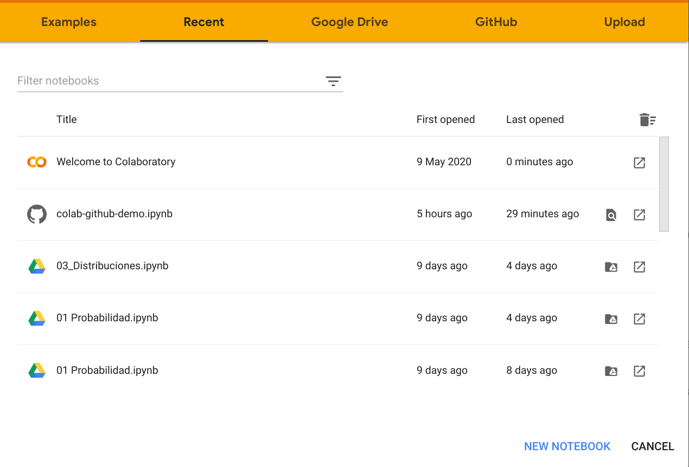
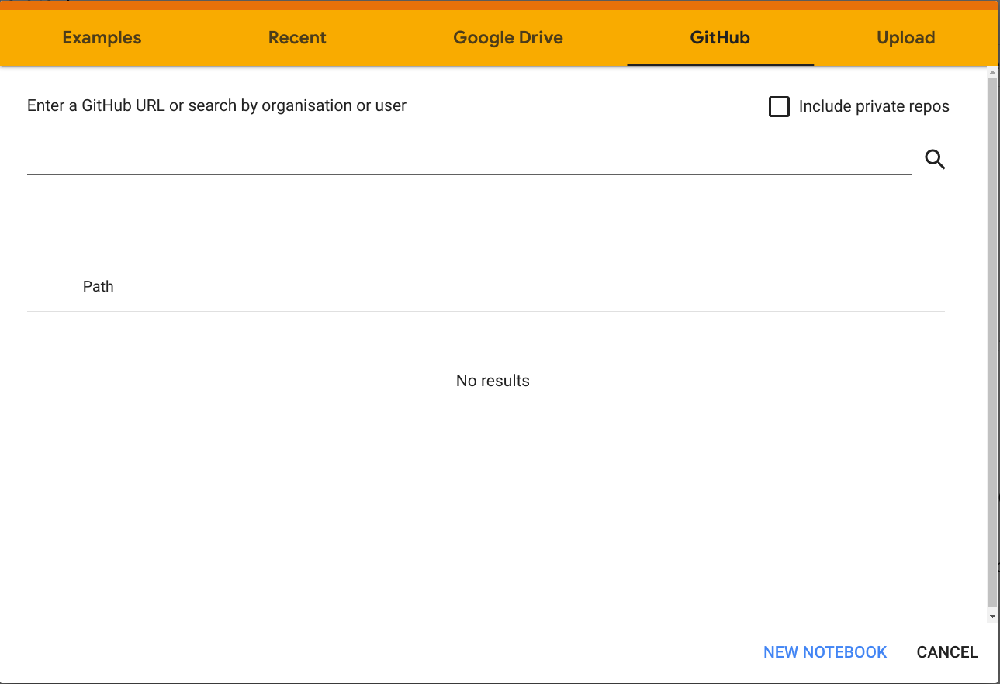
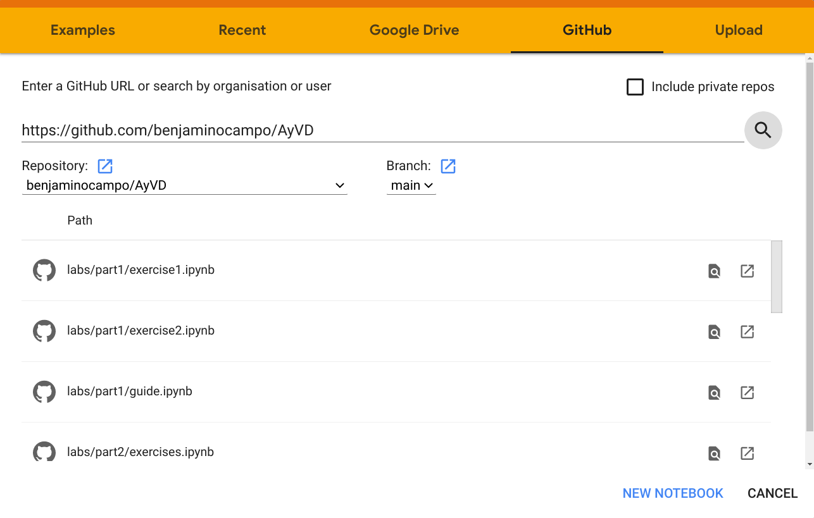
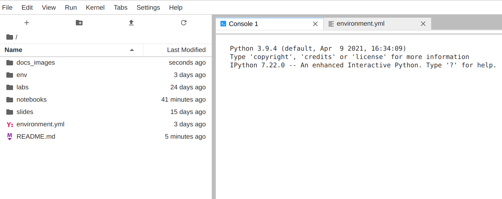
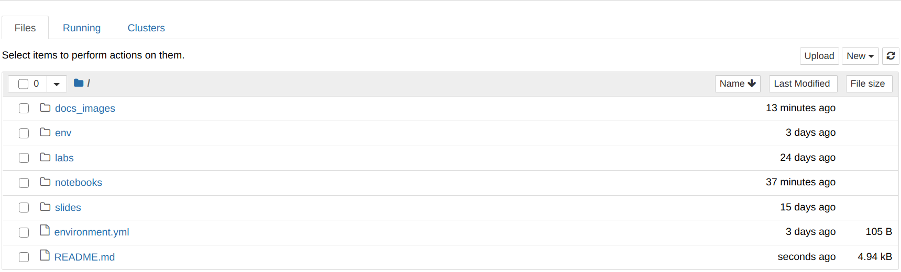
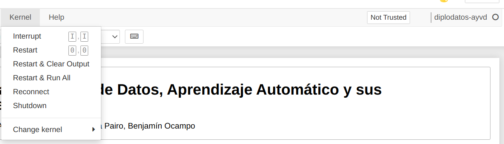
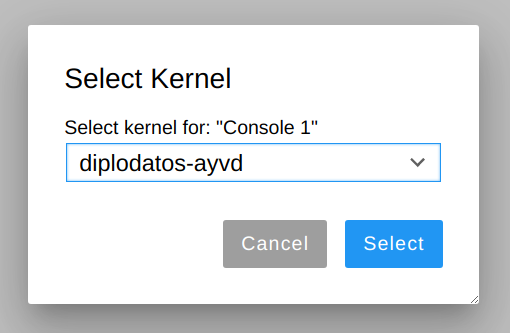

# Data Science, Machine Learning, and its Applications

## About the Layout

The solution of the assignments can be found in `labs`, divided in their
corresponding parts. Files `guides.ipynb` are the notebooks with the exercises
to solve. They may be split in several notebooks `exerciseN.ipynb` or kept in
just one `exercises.ipynb` (it'll depend if it was considered necessary). They
also have a `.py` version so they can be recognized by git.

Directories `notebooks` and `slides`, have the material given by the class.

## Updating Notebooks

This documentation describe two different ways to start working remotely.

### Running in the cloud through Google Colab + GitHub

This method doesn't require any other package or program installed in your
computer than just you're favourite browser.

1. First open Google Colaboratory through this link
   <https://colab.research.google.com/> . You'll see that it opens the following
   window.

    

2. Click on the GitHub tab and paste the url of this repository
   <https://github.com/benjaminocampo/AyVD> on the text blank it shows.
   Then click on the search button to check which notebooks are saved in this
   repository.

    

3. You'll see a list of all the notebooks that are in the repository. Click on
   the one you want to update.

    

4. Then you can start running the notebook!

    

### Running locally through Conda + Jupyter + VirtualEnv + Git

#### Conda

First you need to get installed `conda` which is a python package manager. We
recommend its minimal version `miniconda`. You can check out its installation
guide here:

- Installing on Linux:
  <https://conda.io/projects/conda/en/latest/user-guide/install/linux.html>

- Installing on Windows:
  <https://conda.io/projects/conda/en/latest/user-guide/install/windows.html>

#### Jupyter

Once you've installed `conda`, it can be used to install `jupyterlab`. Open a
terminal window or Anaconda Prompt and run:

```bash
conda install -c conda-forge jupyterlab
```

You can also start with the classic jupyter notebook with:

```bash
conda install -c conda-forge notebook
```

(Note: If you're using Windows you can use the Windows Powersheell or Anaconda
Prompt. Since command line usage varies in Windows and Linux, here's a list of
the most important ones if you're unfamiliar with them:
<https://www.thomas-krenn.com/en/wiki/Cmd_commands_under_Windows>).

#### Git

Installing `git` will depend on your operative system:

- Installing on Linux (on Debian-based distributions):

    ```bash
    sudo apt install git-all
    ```

- Installing on Windows: Download the .exe from its main page on
  https://git-scm.com/download/win . Execute it, and follow the steps.

In order to check out that the installation proceded correctly open a terminal
or Anaconda Prompt and run:

```bash
git --version
```

If it shows your current git version, you can move on with next step!

#### Cloning this repository

After installing git, you can clone this repository to have a local version of
it. Open a terminal in the directory you want to save it and run:

```bash
git clone https://github.com/benjaminocampo/AyVD.git
```

#### Setting up a Virtual Environment

In order to install the packages that are necessary to run the notebooks we
recommend to create a virtual environment so they won't be installed in your
global system.

Each directory has an `environment.yml` file that lists the dependencies needed
to run correctly the notebooks inside it. In the case of the `AyVD` directory,
the content of this file is:

```yml
name: diplodatos-ayvd
dependencies:
  - numpy
  - pandas
  - matplotlib
  - statsmodels
  - seaborn=0.11
```

That means that the environment to create has the name diplodatos-ayvd and the
dependencies are `seaborn=0.11` and the newest versions of `numpy`, `pandas`,
`matplotlib`, and `statsmodels`

The steps to create a virtual environment with these dependencies are the
following:

1. Open your terminal or Anaconda Prompt in the directory you have cloned the
   repository.

2. Create the environment from the `environment.yml` file with:

    ```bash
    conda env create -f environment.yml
    ```

    (Note: This step might take some time).

3. Activate the environment in order to have available the dependencies with:

    ```bash
    conda activate diplodatos-ayvd
    ```

    The active environment is also displayed in front of your prompt in
    (parentheses) or [brackets] like this:

    ```bash
    (diplodatos-ayvd)$
    ```

4. If you don't have installed ipykernel on your system, run:

    ```bash
    conda install -c anaconda ipykernel
    ```

    Then, add the active environment to jupyter so its recognized as a new kernel:

    ```bash
    ipython kernel install --user --name=diplodatos-ayvd
    ```

5. Run jupyter lab or jupyter notebook with:

    ```bash
    jupyter lab
    ```

    

    or

    ```bash
    jupyter notebook
    ```

    

6. The previous step should have opened a tab on your browser with the
   application. Open the jupyter notebook you're working on.

7. Be sure that jupyter is using the kernel you have just set by choosing
   **Kernel -> Change Kernel**:

    

    

8. You're ready to do science!
